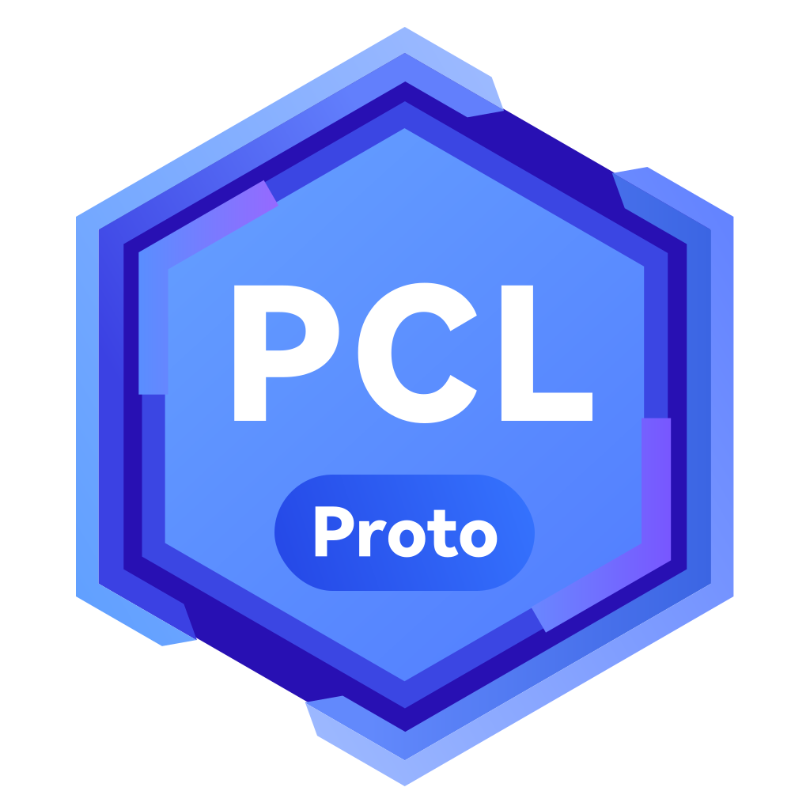
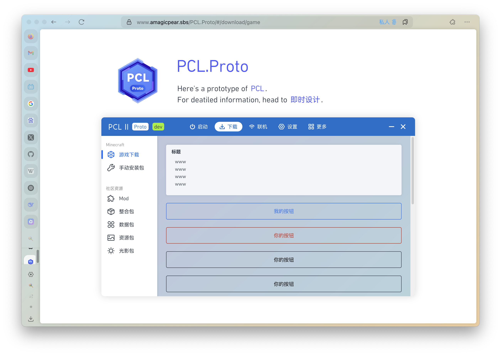

# PCL.Proto

<p align="center">
  
</p>

随着PCL的分支版本竞相启动，UI的还原成为了一大困扰众开发者的难题。PCL.Proto 应运而生。



本项目以[PCL2（龙腾猫跃）](https://github.com/Hex-Dragon/PCL2)和[PCL2-CE](https://github.com/PCL-Community/PCL2-CE)为蓝本。旨在为各PCL分支版本提供一个标准化的原型样本。该仓库使用 Vue3 搭建，如果你的仓库使用 Webview 作为前端，则可以直接引用该项目。

你可以前往 [PCL.Proto](https://www.amagicpear.sbs/PCL.Proto/) 在线查看本项目。

## 原型

如果你的 PCL 分支版本并非基于 Web 技术，则直接使用本仓库可能并不显得那么方便。那么，你可以前往 [即时设计 - 「PCL.Prototype」](https://js.design/f/QVPQRY?p=zX2rcVk6Cy&mode=design)查看具体的应用原型，并切图导出或参考其生成的样式代码。

如果你想协助修改原型设计文件，欢迎[点击此链接](https://js.design/ti?c=tS-6qs0WDQJ3H4)加入团队。

## 项目配置

```sh
bun install
```

### 开发时热重载

```sh
bun dev
```

### 发布

```sh
bun run build
```
