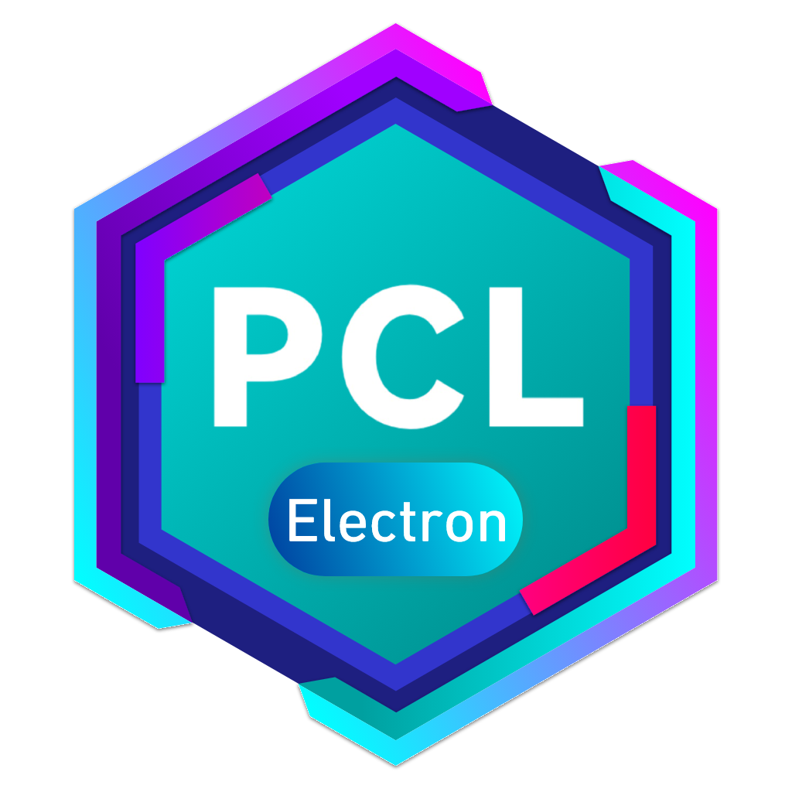

# PCL.Electron.App

<p align="center">
  
</p>

PCL.Electron.App是基于Nodejs的Electron和PCL.Proto制作的PCL2分支版本


本项目基于[PCL.Proto](https://github.com/PCL-Community/PCL.Proto)为前端

你可以前往 [PCL.Proto](https://www.amagicpear.sbs/PCL.Proto/) 在线查看。

## 项目配置

### 克隆项目

```sh
git clone https://github.com/Realaf-Team/PCL.Electron.App.git
```

### 安装依赖

```sh
pnpm install
```

### 开发时热重载

```sh
pnpm run dev:electron
```

### 发布

```sh
pnpm run package
```
